<p align="center">
  <picture>
    <source media="(max-width: 600px)" srcset="./assets/banner-mobile.svg" />
    
  </picture>
</p>

<p align="center">
  <a href="https://www.linkedin.com/in/gilbert-geraldo-534939364/"></a>
  &nbsp;
  <a href="mailto:gilbertcat6@gmail.com"></a>
  &nbsp;
  <a href="https://www.instagram.com/geraldo1_0_0_1/"></a>
</p>

<p align="center">
  <a href="#about-me">About</a> &nbsp; · &nbsp;
  <a href="#tech-stack">Tech stack</a> &nbsp; · &nbsp;
  <a href="#problem-solving">Problem solving</a> &nbsp; · &nbsp;
  <a href="#github-activity">Activity</a>
</p>

## About me

Hi, I'm **Gilbert Geraldo** — call me **Aldo**. A Machine Learning Engineer studying **Data Science at Telkom University**, based in Bandung, Indonesia.

> Turning data and algorithms into intelligent systems.

- **Exploring** machine learning, AI, and data engineering.
- **Building** backend systems with Go, Python, and C++.
- **Practicing** algorithms through competitive programming.

<details>
<summary><b>Behind the profile</b> · a little Go</summary>

```go
package main

import "fmt"

func main() {
    aldo := struct {
        Name       string
        Role       string
        University string
        Location   string
        Languages  []string
        Focus      string
    }{
        Name:       "Gilbert Geraldo",
        Role:       "Machine Learning Engineer",
        University: "Data Science @ Telkom University",
        Location:   "Bandung, West Java, Indonesia",
        Languages:  []string{"Go", "Python", "C++"},
        Focus:      "Building intelligent systems",
    }

    fmt.Printf("Hello, world! I'm %s.\n", aldo.Name)
}
```

</details>

## Tech stack

<table>
  <thead>
    <tr><th align="left">The toolkit</th><th align="left" width="100%">What I work with</th></tr>
  </thead>
  <tbody>
    <tr>
      <td><b>Languages</b></td>
      <td>  </td>
    </tr>
    <tr>
      <td><b>ML &amp; data</b></td>
      <td>  </td>
    </tr>
    <tr>
      <td><b>Databases</b></td>
      <td> </td>
    </tr>
    <tr>
      <td><b>Tools &amp; design</b></td>
      <td>  </td>
    </tr>
  </tbody>
</table>

## Problem solving

Small challenges. Sharper intuition. Better solutions.

<p>
  <a href="https://leetcode.com/u/ALDOSFINESHYT/"></a>
  &nbsp;
  <a href="https://codeforces.com/profile/aldos"></a>
</p>

## GitHub activity

Building in public, one contribution at a time.

<p>
  <a href="https://github.com/Gilbertgeraldo?tab=repositories">Browse repositories ↗</a> &nbsp; · &nbsp;
  <a href="https://github.com/Gilbertgeraldo?tab=overview">Recent contributions ↗</a>
</p>

<details>
<summary><b>By the numbers</b> · stats, streak &amp; languages</summary>

<p align="center">
  <a href="https://github.com/Gilbertgeraldo?tab=repositories">
    
  </a>
</p>

<p align="center">
  
</p>

<p align="center">
  
</p>

</details>

<p align="center">
  <picture>
    <source media="(prefers-color-scheme: dark)" srcset="https://raw.githubusercontent.com/Gilbertgeraldo/Gilbertgeraldo/output/github-contribution-grid-snake-dark.svg" />
    
  </picture>
</p>

---

<p align="center">
  <b>Let's talk data, algorithms, and interesting ideas.</b><br />
  <a href="mailto:gilbertcat6@gmail.com">Say hello</a> &nbsp; ↗
</p>
